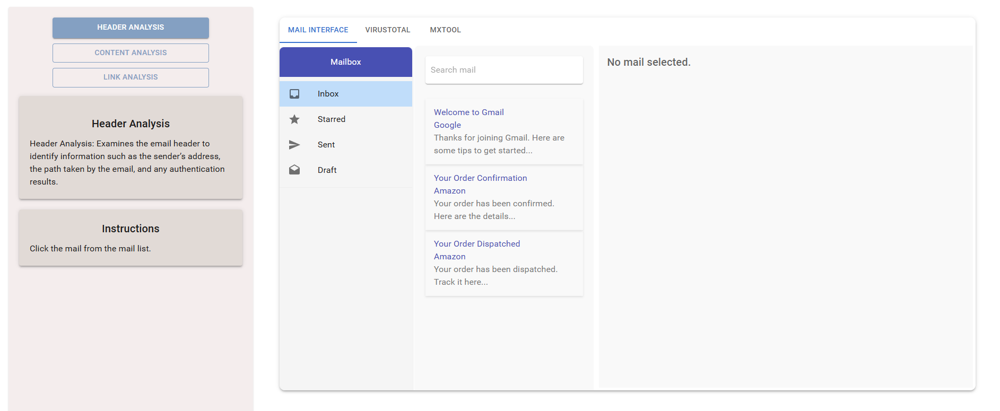
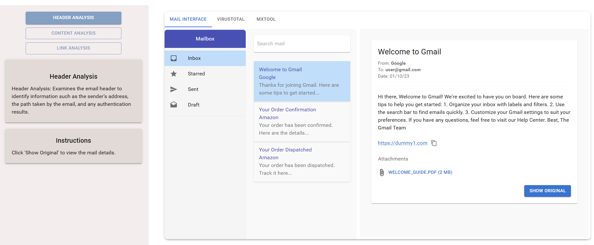
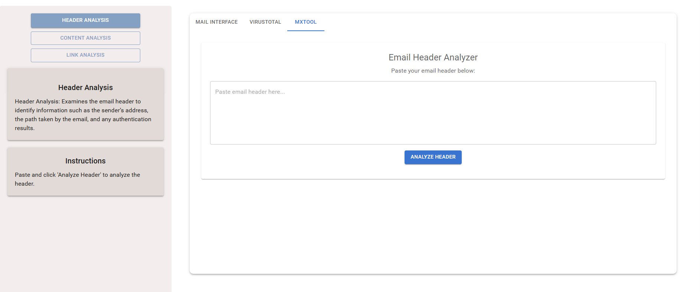
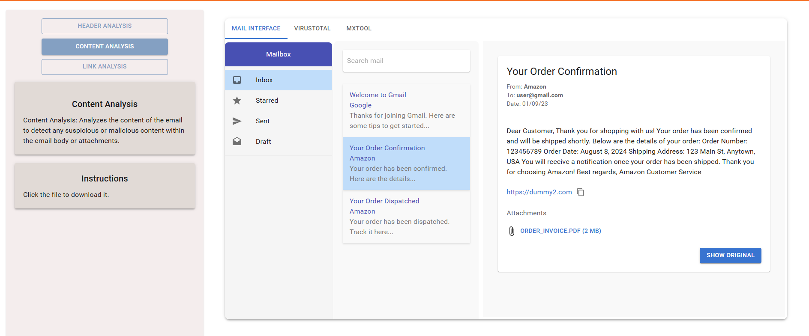
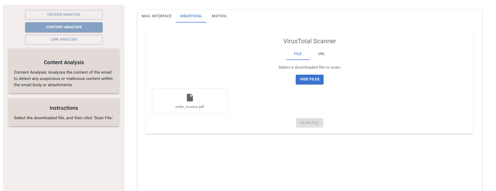
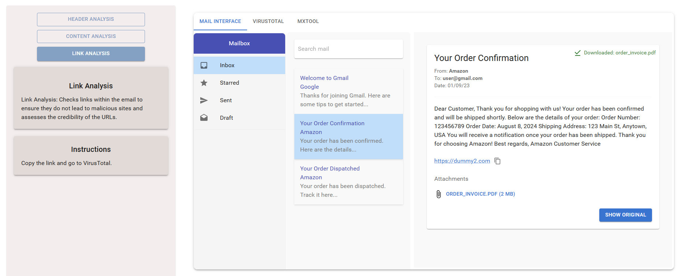
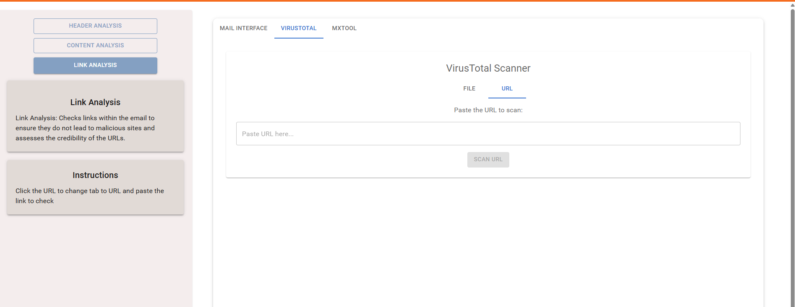

##### Header Analysis

Click the mail from the mail list.
  
  

Click the 'Show Original' button to view the mail details.
  
  

Copy the original message, go to the MXToolbox, paste the mail details, and click the 'Analyze Header' button to analyze the details.
  
  

##### Content Analysis

Click the mail from the mail list, and go to the VirusTotal tab.
  
  

Click the 'Choose File' button, select the file, and scan it.
  

  
##### Link Analysis

Click the mail from the mail list, copy the link, and go to VirusTotal.
  
  

Click the URL tab, paste the link, and check it.
  

